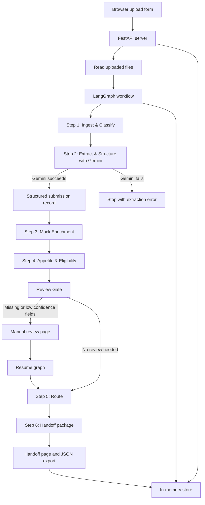
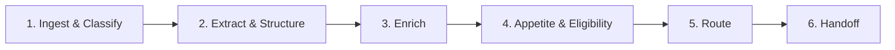

# Submission Triage v2 Architecture

This is a simple prototype. It takes broker documents, asks Gemini to extract structured data, runs deterministic triage checks, then shows the result in the browser.

It does not call Jura, Aria, or the old triage app.

## Data Flow



## What Happens When You Click Submit

1. The browser sends broker metadata and uploaded files to `POST /submissions`.
2. FastAPI reads the uploaded PDF, DOCX, or TXT files.
3. The app creates a new in-memory submission ID.
4. LangGraph starts the six-step workflow.
5. Gemini extracts the insurance fields from the document.
6. The app validates Gemini's JSON using Pydantic models.
7. Mock enrichment adds fake D&B, claims, and geo/cat context.
8. Guidelines check class code, limits, and prohibited classes.
9. The route step chooses a queue.
10. The handoff page shows the final package.

## Main Components

| Component | File | Simple meaning |
| --- | --- | --- |
| FastAPI routes | `triage/server.py` | Receives browser requests and returns pages/API responses. |
| File reader | `triage/documents.py` | Converts uploads into text or PDF bytes. |
| LangGraph workflow | `triage/graph.py` | Controls the six workflow steps. |
| Gemini extraction | `triage/llm.py` | Sends document content to Gemini and validates the JSON response. |
| Mock enrichment | `triage/enrichment.py` | Adds deterministic fake enrichment data. |
| Guidelines and routing | `triage/guidelines.py` | Applies local YAML rules and picks a queue. |
| Data models | `triage/models.py` | Defines the shape of submissions, guidelines, routing, and handoff data. |
| In-memory store | `triage/store.py` | Keeps submissions while the server is running. Restarting clears it. |
| UI templates | `templates/` | Browser pages for queue, review, and handoff. |
| CSS | `static/app.css` | Styling for the demo UI. |

## The Six Steps



### Step 1: Ingest & Classify

The app accepts broker metadata and uploaded documents.

### Step 2: Extract & Structure

Gemini reads the document text and returns structured fields like named insured, class code, limits, locations, payroll, revenue, losses, missing fields, and confidence.

There is no fallback extractor. If Gemini fails, the graph stops here.

### Step 3: Enrich

The app adds deterministic mock enrichment. This is fake data for demo purposes only.

Geo/cat context is shown as extra information, but it is not used for Step 4 decisions.

### Step 4: Appetite & Eligibility

The app checks:

- class code
- limits
- prohibited classes

It does not check geography.

It does not calculate risk score.

### Step 5: Route

The app chooses one queue:

- `ready_for_uw`
- `missing_info`
- `senior_uw_review`
- `prohibited_class_review`

The agent only routes. It does not approve, decline, quote, or bind.

### Step 6: Handoff

The app creates a package for the underwriter. It includes extracted fields, confidence, enrichment, guideline results, routing, missing info, rationale, and failure analysis.

## Where The Demo Can Go Wrong

The important demo story is this:

1. The source document may mention something risky, like roofing.
2. Gemini may normalize the business into a safer-looking class code.
3. Step 4 trusts the normalized class code.
4. The route may become `ready_for_uw`.
5. The handoff page shows a failure analysis section so you can explain the control gap.

In simple words: the workflow can look clean, but the source evidence can still suggest the agent made a bad triage decision.

## Runtime State

The app uses in-memory state only.

That means:

- submissions disappear when the server restarts
- there is no database
- there are no downstream system calls
- Gemini is the only external API call

## Terminal Logs

When you run:

```bash
.venv/bin/uvicorn triage.server:app --port 8004
```

the terminal prints logs for:

- upload received
- document parsing
- graph start
- each workflow step
- Gemini request and response
- guideline decision
- route decision
- handoff creation
- errors

These logs are meant to help you see what is happening after you click submit.
